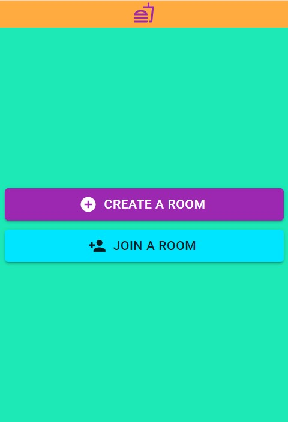
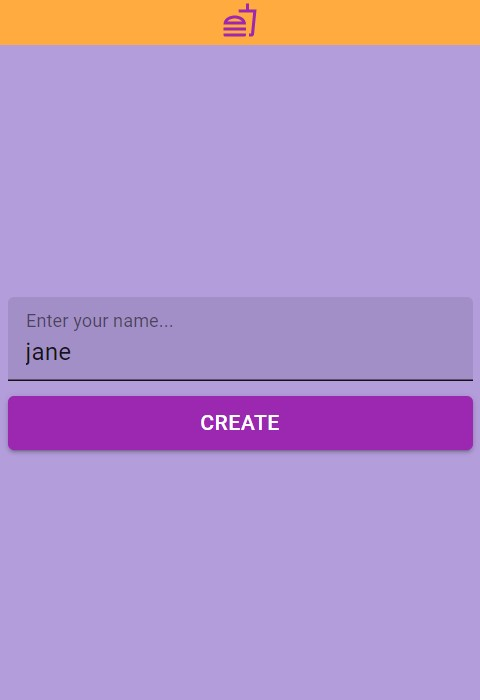
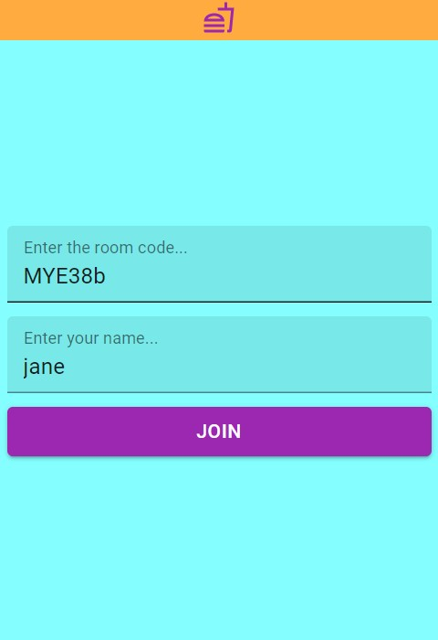
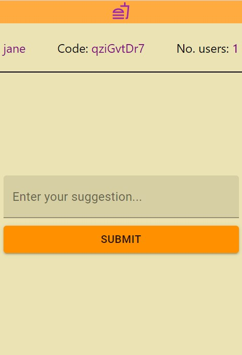

## Lunch Roulette
An application to help groups of people decide what to eat for lunch or dinner. By allowing users to join a group, submit suggestions and receive one suggestion from all the submitted suggestions.

## Getting started

### How to run
This project uses node.js

Install [node.js](https://nodejs.org/en/download/) here

#### Server

The server is the following folder: *lunch-roulette-server*

Run the following commands in a terminal in the project's folder

```bash
npm install
node server
```

#### Client

The client is in the following folder: *lunch-roulette-client*

This project uses **yarn**. To install yarn run the following command in a terminal

```bash
npm install -g yarn
```

Then run the following command using yarn in a terminal in the project's folder

```bash
yarn install
yarn start
```

## Screenshots

### Front page


### Create a room


### Join a room


### Room page

